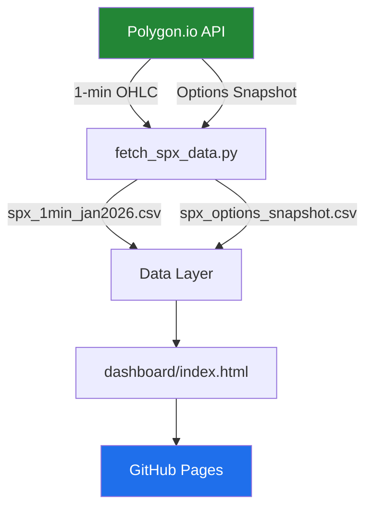
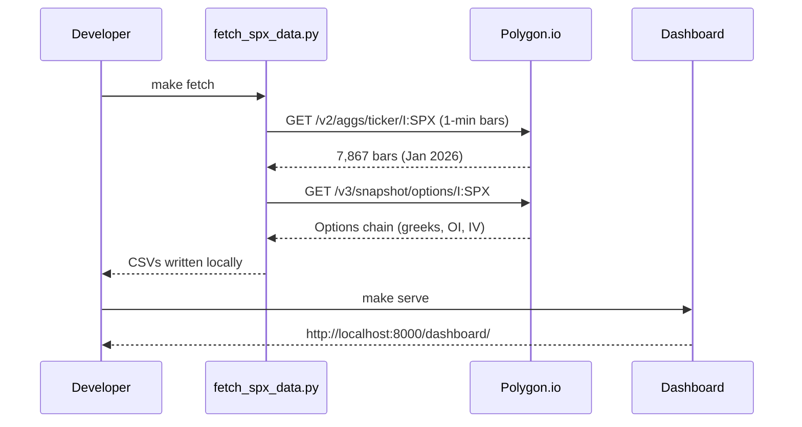
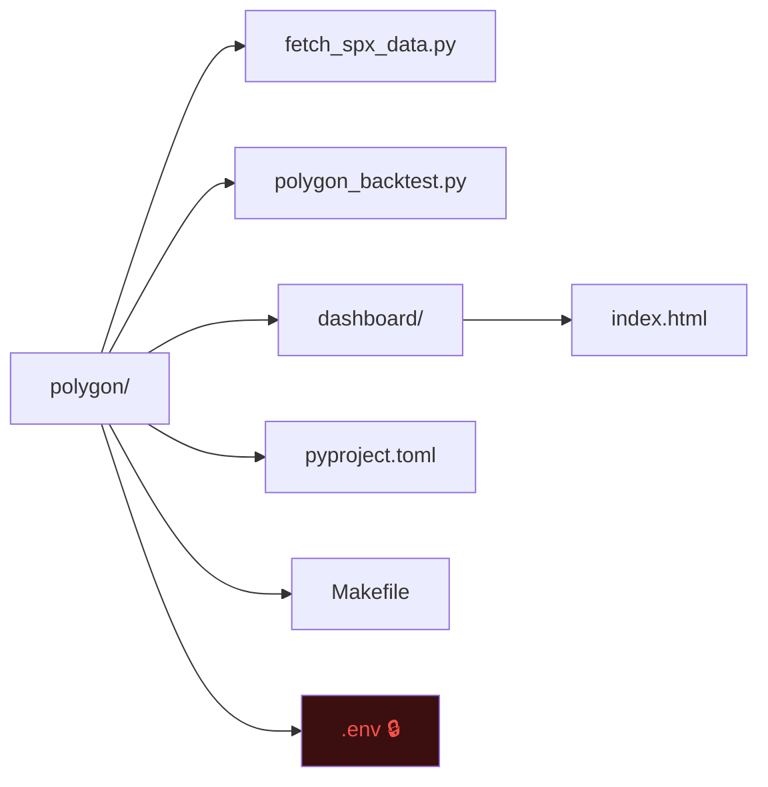
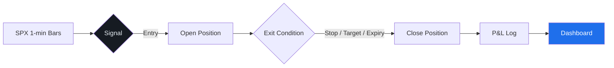

# SPX Options Dashboard

A data pipeline and interactive dashboard for SPX options and price data, powered by [Polygon.io](https://polygon.io).

Live dashboard → **[bhageerath17.github.io/polygon](https://bhageerath17.github.io/polygon)**

---

## Architecture



---

## Data Flow



---

## Project Structure



---

## Backtesting Pipeline _(coming soon)_



---

## Quick Start

### Prerequisites
- [uv](https://docs.astral.sh/uv/) — fast Python package manager
- A [Polygon.io](https://polygon.io) API key

### Setup

```bash
# 1. Clone
git clone https://github.com/bhageerath17/polygon.git
cd polygon

# 2. Copy and fill in your API key
cp .env.example .env

# 3. Install dependencies
make setup

# 4. Fetch SPX data
make fetch

# 5. Open the dashboard locally
make serve
# → http://localhost:8000/dashboard/
```

---

## Environment Variables

| Variable | Description |
|---|---|
| `POLYGON_API_KEY` | Your Polygon.io API key |

Create a `.env` file (never commit it):
```
POLYGON_API_KEY=your_key_here
```

---

## Makefile Commands

| Command | Description |
|---|---|
| `make setup` | Create `.venv` and install all dependencies |
| `make fetch` | Pull latest SPX price + options data |
| `make serve` | Serve dashboard at `localhost:8000` |
| `make run` | Run the backtest script |
| `make clean` | Remove `.venv` and caches |

---

## Dashboard

Shows live SPX insights pulled from Polygon.io:

- **SPX Jan 2026 summary** — open, close, high, low, % move
- **1-min bar count** for the month
- **Average implied volatility** across the options chain
- **Total open interest** split by calls vs puts
- **Top 20 options by open interest** — expiry, strike, greeks, bid/ask
